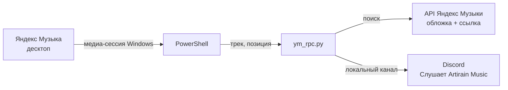

# yandex-music-rpc

Статус в Discord для десктопной Яндекс Музыки — как у Spotify: **«Слушает &lt;название твоего приложения&gt;»**, трек, исполнитель, обложка, прогресс-бар и кнопка «Слушать в Яндекс Музыке». На паузе показывается «(Пауза) название трека».



## Что нужно

- Windows 10 или 11
- [Python 3.10+](https://www.python.org/downloads/) — при установке отметь галочку **Add python.exe to PATH**
- Discord — именно приложение для компьютера, в браузерной версии статус не работает
- [Яндекс Музыка для Windows](https://music.yandex.ru/download/)

Устанавливать библиотеки не нужно — только стандартный Python.

## Установка

### 1. Создай приложение в Discord

Из самого Discord туда не попасть — это сайт.

1. Открой в браузере https://discord.com/developers/applications и войди в свой аккаунт Discord.
2. Справа сверху нажми **New Application**.
3. Введи название. **Именно оно будет в статусе** после слова «Слушает» — например, `Artirain Music` даст «Слушает Artirain Music».
4. Отметь галочку согласия и нажми **Create**.
5. Откроется страница **General Information**. Найди поле **Application ID** и нажми **Copy** — это число вида `123456789012345678`.

Больше на сайте ничего делать не нужно. Public Key и токен бота не понадобятся.

### 2. Скачай проект

Нажми на этой странице зелёную кнопку **Code → Download ZIP** и распакуй архив в любую папку. Или через git:

```
git clone https://github.com/Artirain/yandex-music-rpc.git
```

### 3. Впиши свой ID в `.env`

Открой папку проекта в проводнике, кликни по адресной строке сверху, напиши `powershell` и нажми **Enter** — откроется PowerShell сразу в этой папке. Выполни, подставив свой ID:

```powershell
Set-Content .env "DISCORD_CLIENT_ID=123456789012345678" -Encoding ascii
```

Через Блокнот тоже можно: создай файл с одной строкой `DISCORD_CLIENT_ID=твой_id`, при сохранении выбери **Тип файла: Все файлы** и назови его `.env`. Иначе Блокнот сохранит его как `.env.txt`, и скрипт его не найдёт.

### 4. Запусти

Открой Discord и Яндекс Музыку, включи трек, затем в той же папке:

```
python ym_rpc.py
```

В консоли будут появляться текущие треки:

```
▶ SOM — Son of Winter
⏸ LAAVU — Вспять
```

Пока окно консоли открыто — статус работает. Закроешь окно — статус пропадёт.

## Если статус не появился

| Что видно | Что сделать |
|---|---|
| `KeyError: 'DISCORD_CLIENT_ID'` | Файла `.env` нет рядом с `ym_rpc.py` или он называется `.env.txt` — см. шаг 3 |
| `discord unavailable` | Discord не запущен или открыт в браузере — нужно приложение для компьютера |
| В консоли `■ nothing playing`, хотя музыка играет | Трек слушается не в десктопной Яндекс Музыке (браузер пока не поддерживается) |
| В консоли трек есть, в Discord пусто | Discord → **Настройки → Конфиденциальность активности** → включи **«Отображать текущую активность»** |
| Нет обложки | Трек не нашёлся в поиске Яндекс Музыки — статус покажется без картинки |

## Ограничения

- Только Windows и только десктопное приложение Яндекс Музыки.
- Обложка ищется по «исполнитель + название», поэтому у редких треков может подтянуться обложка другого релиза.
